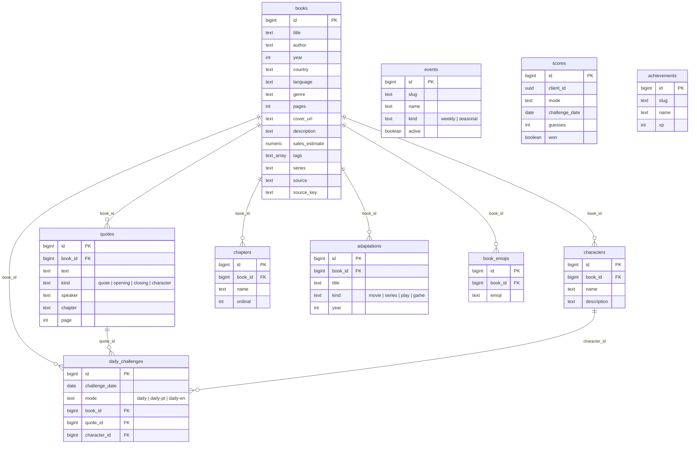

# 📚 LivreLee

[🇧🇷 Português](README.md) | 🇺🇸 English

A daily book-guessing game, Wordle-style. 23 different ways to figure out the book — attribute grid, quotes, emoji, cover art, "higher or lower" between two cards, and more. No sign-up: everything runs on an anonymous id saved in the browser.

## Stack

- **Next.js (App Router) + TypeScript + Tailwind** — frontend and API in the same project, deployed on Vercel
- **Supabase** — PostgreSQL and Storage for covers (no Auth: the project has no user accounts)
- **Vercel Cron** — picks the daily book and the seasonal event at midnight (Brasília time)
- **lucide-react** — interface icons

## Running locally

```bash
npm install
npm run dev
```

With no configuration at all, the app runs on a local 12-book dataset ([src/lib/seed-books.ts](src/lib/seed-books.ts)) and demo content ([src/lib/seed-content.ts](src/lib/seed-content.ts)) — you can play all 23 modes end to end without a database.

## Connecting Supabase

1. Create a project at [supabase.com](https://supabase.com)
2. In the SQL Editor, run [supabase/schema.sql](supabase/schema.sql) and then [supabase/seed.sql](supabase/seed.sql) (~1000 real books, generated — see below)
3. Copy `.env.example` to `.env.local` and fill it in with your project's keys (Settings → API). The dashboard sometimes calls the public key "anon key", sometimes "publishable key" — the app accepts both variable names, use whichever shows up in your dashboard
4. Restart `npm run dev` — data now comes from the database

### Database schema

Everything in the game revolves around `books`; the rest are satellite tables linked by `book_id`. `daily_challenges` pins down the day's challenge (per mode/language), pointing to a book and, when the mode depends on a specific clue, also to a quote or character. `events`, `scores`, and `achievements` have no FK — they're independent catalogs/records. Full definition in [supabase/schema.sql](supabase/schema.sql) (kept local-only, not version-controlled — see `.gitignore`).



**If search/guessing throws a "permission denied for table ..." error**: table-level `GRANT`s are missing for the `anon`/`authenticated` roles — RLS alone doesn't grant access. This happens if you ran an older version of `schema.sql` before the grants existed. Run this directly in the SQL Editor:

```sql
grant usage on schema public to anon, authenticated;
grant select on public.books, public.quotes, public.characters, public.chapters,
  public.adaptations, public.book_emojis, public.events,
  public.achievements to anon, authenticated;
-- daily_challenges also needs INSERT: if the cron hasn't run yet today,
-- reading the round itself draws and writes today's challenge on the spot,
-- using the anon key.
grant select, insert on public.daily_challenges to anon, authenticated;
grant select, insert on public.scores to anon, authenticated;
```

**If the ingestion jobs (`node scripts/run-jobs.mjs ...` or the GitHub Action) throw "permission denied for table books"**: same cause, but for `service_role` — it bypasses RLS, but still needs the table-level `GRANT` (that's a separate layer). Run:

```sql
grant usage on schema public to service_role;
grant all on all tables in schema public to service_role;
grant all on all sequences in schema public to service_role;
```

After running it, force PostgREST to reload its permissions cache (otherwise the effect only shows up minutes later):

```sql
NOTIFY pgrst, 'reload schema';
```

(Re-running the whole `schema.sql` doesn't work in this case — `create policy` has no `if not exists` and will throw a "policy already exists" error.)

**Important in production:** set `ROUND_SECRET` (or at least `CRON_SECRET`) in your environment variables. Round tokens are signed with HMAC; without your own secret, the code falls back to a fixed development value, and anyone who reads the repository can forge a "win".

### Generating the book collection

`supabase/seed.sql` is generated by a script that pulls real books from [Open Library](https://openlibrary.org), limited to **Portuguese and English** (the two languages the game filters by):

```bash
node scripts/fetch-books.mjs
```

Collects ~1000 books spread across 22 genres, with real title, author, year, page count, and cover. Country/language come from a map of known authors ([scripts/jobs/book-lang.mjs](scripts/jobs/book-lang.mjs)) or are safely inferred from the search's own language filter — never guessed from an ambiguous list of editions/translations.

To keep the database up to date after the initial seed, use the job runner:

```bash
node scripts/run-jobs.mjs --list     # lists available jobs
node scripts/run-jobs.mjs            # runs the default set (openlibrary + google-books)
```

- `openlibrary` — incrementally imports new books (upsert by `source`+`source_key`, no duplicates)
- `google-books` — enriches books that don't have a synopsis yet with synopsis/tags/page count
- `covers` — fills in `cover_url` for books left without a cover (searches by ISBN, then by title+author on Open Library)
- `characters` — main characters via Wikidata (the book item's "characters" property, P674): name + short description, structured data under CC0
- `adaptations` — movies/series/plays/games via Wikidata (works that point back to the book via P144 "based on")
- `quotes` — opening/closing line (First Line/Last Line modes) via Project Gutenberg, **public-domain books only**: since Gutenberg only distributes works whose copyright has expired, extracting the 1st/last sentence from the full text carries none of the legal risk of scraping excerpts from a copyrighted book. A "famous" quote (Quote mode) and character lines remain manually curated — they require human judgment about relevance, not just position in the text.
- `sales` — fills `sales_estimate` with the number of copies sold cited in the book's Wikipedia summary (e.g. "sold over 120 million copies"). It's not a made-up estimate, but it's also not curator-verified — it's whatever number Wikipedia itself reports, with whatever precision/freshness that has. A deliberate project decision: without it, the **Sales** mode would be limited to the 12 books in the local dataset.
- `recalc-rankings` — registered as a stub in the runner, no data source configured yet.

**These jobs don't run on their own** — they're standalone Node scripts, nothing schedules them automatically (the project's only real crons are `/api/cron/daily` and `/api/cron/events`, see [vercel.json](vercel.json), and they only handle the daily challenge/active event). To run them continuously, there's a ready-made GitHub Actions workflow at [.github/workflows/ingestion-jobs.yml](.github/workflows/ingestion-jobs.yml):

- Runs once a day at 04:00 UTC (one hour after the daily-challenge cron), with the full set of jobs.
- Can also be triggered on demand: **Actions → Jobs de ingestão → Run workflow** tab, with the option to pick just a few jobs (e.g. `covers` to test it in isolation).
- Needs 3 *repository secrets* (**Settings → Secrets and variables → Actions → New repository secret**):
  - `SUPABASE_URL` — same URL as in `.env.local`
  - `SUPABASE_SERVICE_ROLE_KEY` — the service role key (never the anon/publishable one)
  - `GOOGLE_BOOKS_KEY` — optional, only needed for a higher volume on the Google Books API
- GitHub Actions was chosen over a Vercel cron calling an API route because the Wikidata/Gutenberg jobs make several sequential calls with pauses between them (being polite to public APIs) — that easily exceeds Vercel's serverless function timeout, and Actions has no such limit.

### Daily book draw

The daily challenge is **drawn automatically**, with one variant per language (`daily`, `daily-pt`, `daily-en`) so the books' language filter doesn't break the "everyone sees the same book" rule. The [/api/cron/daily](src/app/api/cron/daily/route.ts) cron guarantees the day's three rows in `daily_challenges`; if it doesn't run, reading the round itself draws and records it on the spot (self-healing). Never repeats a book **within the same language** until the collection is exhausted. Logic in [src/lib/daily.ts](src/lib/daily.ts).

### Seasonal events

An event (weekly by genre, or seasonal by date — Halloween, Christmas, etc.) is always active, computed purely from the calendar in [src/lib/events.ts](src/lib/events.ts) — works without a database. The [/api/cron/events](src/app/api/cron/events/route.ts) cron only mirrors this into the `events` table for history/reporting purposes.

## Deploy (Vercel)

1. Import the repository into Vercel
2. Configure the environment variables from `.env.example` (including `CRON_SECRET` and `ROUND_SECRET`)
3. The crons in [vercel.json](vercel.json) run `/api/cron/daily` (03:00 UTC) and `/api/cron/events` (03:05 UTC) — both at midnight Brasília time

## Game modes

23 modes across 7 groups (central registry in [src/lib/modes/registry.ts](src/lib/modes/registry.ts); names/descriptions in [src/lib/i18n/dictionaries.ts](src/lib/i18n/dictionaries.ts)):

| Group | Modes |
|---|---|
| **Comparison** | Daily, Unlimited, Book Age, Page Count, Sales |
| **Quotes** | Quote, First Line, Last Line, Character Line |
| **Guess by the Book** | Character, Book by Character, Chapter, Adaptation |
| **Other Clues** | Emoji, Synopsis, Tags, Timeline |
| **Cover** | Cover (Zoom), Blurred Cover, Silhouette |
| **Author** | Author, Guess the Author |
| **Special** | Mixed (draws a different clue mode each round) |

Two game mechanics, selected via `mode.mechanic` in the registry:

- **`guess`** (most modes): search for the book/author by text, get a feedback grid (or a clue — quote, emoji, cover...), up to `maxGuesses` attempts. Runs through `/api/round` + `/api/guess`.
- **`higher-lower`** (Age, Pages, Sales): two book cards side by side — one revealed, one hidden — and the player clicks whichever they think has the higher value. Get it right, the game continues in sequence (streak); get it wrong, it just resets the streak — there's no end, the player "can play many times" without leaving the screen. Runs through `/api/compare/round` + `/api/compare/guess`, with its own signed token ([src/lib/compare-token.ts](src/lib/compare-token.ts)).

Adding a new mode with the `guess` mechanic doesn't require a new page or route: just an object in `registry.ts` (plus a case in [Clue.tsx](src/components/Clue.tsx) if it's a brand-new clue type) and the translations in `dictionaries.ts`.

## No user accounts

There's no login. Each browser gets a `client_id` (UUID) generated on first visit, used only for the daily mode's anonymous ranking. Progress (stats, achievements, streak) lives in `localStorage` — clearing the browser resets everything. See [src/lib/storage.ts](src/lib/storage.ts).

## Achievements

Static catalog of 18 achievements in 4 groups (First Steps, Progression, Streaks, Challenges) — [src/lib/achievements.ts](src/lib/achievements.ts). Evaluated and stored client-side after every game; there's no per-user achievements table in the database (the schema's `achievements` table is just a reference catalog, not read by the app today).

## Internationalization (PT/EN)

Interface in Portuguese or English, independent of the books' language filter (two different concepts — you can play in English while only seeing Portuguese books). Preference saved in the browser via [`LocaleProvider`](src/lib/i18n/LocaleProvider.tsx); every bit of displayed text (mode names/descriptions, achievements, events, game messages) comes from [dictionaries.ts](src/lib/i18n/dictionaries.ts) — the mode/achievement/event registries only store an `id`/`slug`, never the text itself, so there's never two copies drifting apart.

## Structure

```
src/
  app/
    page.tsx                    # home: grouped modes + language filters
    conquistas/page.tsx         # achievements and stats
    play/[mode]/page.tsx        # generic player ("guess" mechanic)
    api/
      books, authors/search/    # autocomplete
      round/, guess/            # round and guess ("guess" mechanic)
      compare/round/, guess/    # round and guess ("higher-lower" mechanic)
      cover/                    # cover fallback (Google Books) on demand
      score/                    # anonymous ranking (client_id)
      cron/daily/, cron/events/ # Vercel Cron
  components/
    SearchBox.tsx                # search with autocomplete and keyboard nav
    GuessRow.tsx                 # attribute grid ("guess" mechanic)
    Clue.tsx                     # renders each mode's clue
    CompareGame.tsx               # UI for the "higher-lower" mechanic
    icons.tsx                    # lucide icons per mode/group/achievement
    LocaleSwitch.tsx              # interface language switcher
  lib/
    modes/registry.ts + types.ts # central registry of the 23 modes
    rounds.ts                    # builds clue + answer ("guess" mechanic)
    compare.ts                   # draws a book pair ("higher-lower" mechanic)
    round-token.ts, compare-token.ts  # stateless HMAC tokens
    data.ts                      # data layer (Supabase or local seed)
    daily.ts                     # daily book draw (no repeats)
    game.ts                      # guess comparison (attribute grid)
    events.ts                    # weekly/seasonal events (pure calendar)
    achievements.ts, storage.ts  # achievements and local persistence
    i18n/                        # PT/EN dictionary + locale context
    cover-fallback.ts             # alternate cover lookup (Google Books)
    seed-books.ts, seed-content.ts  # local development dataset
    supabase/                    # browser and server clients
scripts/
  fetch-books.mjs               # generates supabase/seed.sql from Open Library
  run-jobs.mjs                  # database maintenance jobs runner
  jobs/                         # openlibrary, google-books, book-lang, lib
supabase/
  schema.sql                    # tables + RLS
  seed.sql                      # ~1000 books (generated)
```

## Roadmap

- **Done:** 23 modes (2 mechanics), daily with no repeats, achievements, seasonal events, PT/EN i18n, collection language filter, anonymous ranking without accounts, characters/adaptations/covers jobs (Wikidata/Open Library), public-domain quotes (Gutenberg), sales via Wikipedia, CI workflow (GitHub Actions) for the jobs, event genre filter wired into the book draw
- **Next:** `recalc-rankings` (still a stub, no data source yet), curation admin panel, Android app (Capacitor), premium
