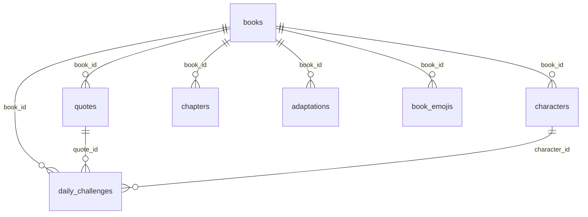

# 📚 LivreLee

[🇧🇷 Português](README.md) | 🇺🇸 English

A Wordle for books. There's a new book to guess every day, and beyond the classic mode (attribute grid) there are 20+ other ways to play — by quote, by emoji, by a blurred cover, "higher or lower" between two cards, and more. No sign-up: each browser just gets its own anonymous id.

## Why it exists

I wanted a book-Wordle that wouldn't get old fast. Instead of just "guess from the grid," I built a central mode registry ([src/lib/modes/registry.ts](src/lib/modes/registry.ts)) — every new mode is just an object in that file, no dedicated page or route. That's the core idea of the whole project: the player, the round API, and the guess API are all generic and just read from that registry.

Two mechanics cover everything:
- **`guess`** — search for the book by text, get a clue (quote, emoji, cover, synopsis...), try until you run out of guesses.
- **`higher-lower`** — Age/Pages/Sales: two cards side by side, one revealed, you bet whether the hidden one is higher or lower. No end, it just resets your streak when you miss.

## Running locally

```bash
npm install
npm run dev
```

With zero setup it already runs on 12 demo books — you can play everything end to end without a database. To use the real collection (~1000 books from Open Library), set up Supabase:

1. Create a project at [supabase.com](https://supabase.com)
2. Run [supabase/schema.sql](supabase/schema.sql) and then [supabase/seed.sql](supabase/seed.sql) in the SQL Editor
3. Copy `.env.example` to `.env.local` and fill it in with your dashboard's keys
4. `npm run dev` again

If you get "permission denied for table ...", you're missing a table `GRANT` for the `anon`/`authenticated` roles (or `service_role`, if it's an ingestion job complaining) — RLS alone doesn't grant access. The right `GRANT`s are already in `schema.sql`; if you ran an older version, the quick fix is:

```sql
grant usage on schema public to anon, authenticated, service_role;
grant select on public.books, public.quotes, public.characters, public.chapters,
  public.adaptations, public.book_emojis, public.events, public.achievements to anon, authenticated;
grant select, insert on public.daily_challenges, public.scores to anon, authenticated;
grant all on all tables in schema public to service_role;
NOTIFY pgrst, 'reload schema';
```

**Important in production:** set `ROUND_SECRET` (or at least `CRON_SECRET`). Round tokens are HMAC-signed — without your own secret, it falls back to a fixed value, and anyone reading the source can forge a win.

## The catalog updates itself

After the initial seed, there's a GitHub Actions workflow ([ingestion-jobs.yml](.github/workflows/ingestion-jobs.yml)) that runs every day on its own, pulling in more real content:

- New books and synopses (Open Library + Google Books)
- Characters and adaptations (Wikidata)
- Opening/closing lines and chapter names — only from **public-domain** books, extracted straight from the full text on Project Gutenberg (no copyright risk here: Gutenberg only distributes what's already public domain)
- Sales estimates (whatever number Wikipedia itself cites, when it cites one)

Needs a few secrets on the repo (`SUPABASE_URL`, `SUPABASE_SERVICE_ROLE_KEY`, `GOOGLE_BOOKS_KEY` optional) — set them up in **Settings → Secrets and variables → Actions**. You can also trigger it manually from **Actions → Run workflow**.

## Deploy

Import into Vercel, set the env vars, done — the crons in [vercel.json](vercel.json) (daily book pick + seasonal event) are active on their own, no extra step.

## The modes

| Group | Modes |
|---|---|
| **Comparison** | Daily, Unlimited, Age, Pages, Sales |
| **Quotes** | First Line, Last Line |
| **Guess by the Book** | Character, Book by Character, Chapter, Adaptation |
| **Other Clues** | Emoji, Synopsis, Tags, Timeline |
| **Cover** | Zoom, Blurred, Silhouette |
| **Author** | Author, Guess the Author |
| **Special** | Mixed |

## Bits worth mentioning

- **Automatic events** — every week a literary genre becomes the theme (Fantasy Week, Horror Week, Sci-Fi Week...), and dates like Halloween/Christmas change the site's look too. All calculated from the calendar, no database needed — [src/lib/events.ts](src/lib/events.ts).
- **Real i18n** — the PT/EN interface is independent of the books' language. You can play in English while only seeing Portuguese books.
- **No accounts** — just a `client_id` in the browser for the daily mode's ranking. Progress lives in `localStorage`.
- **DB schema**, if you're into diagrams:



## Roadmap

- **Done:** 21 modes, daily with no repeats, achievements, events, i18n, anonymous ranking, catalog that keeps itself updated via daily jobs
- **Pending:** Emoji mode still has no content source (manual curation or an LLM, to be decided), `recalc-rankings` is still a stub, admin panel, Android app
