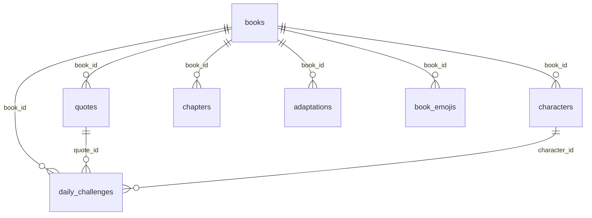

# 📚 LivreLee

🇧🇷 Português | [🇺🇸 English](README.en.md)

Um Wordle de livros. Todo dia rola um livro novo pra adivinhar, e além do modo clássico (grade de atributos) tem mais 20 jeitos diferentes de jogar — por frase, por emoji, pela capa borrada, "maior ou menor" entre duas cartas, e por aí vai. Sem cadastro: cada navegador tem um id anônimo próprio e pronto.

## Por que existe

Queria um Wordle de livros que não enjoasse rápido. Em vez de fazer só "adivinha pela grade", montei um registro central de modos ([src/lib/modes/registry.ts](src/lib/modes/registry.ts)) — cada modo novo é só um objeto nesse arquivo, sem página nem rota própria. Isso é o coração do projeto: o player, a API de rodada e a de palpite são genéricos e leem esse registro.

Duas mecânicas cobrem tudo:
- **`guess`** — busca o livro por texto, recebe uma pista (frase, emoji, capa, sinopse...), tenta até estourar as tentativas.
- **`higher-lower`** — Idade/Páginas/Vendas: duas cartas lado a lado, uma revelada, você aposta se a oculta é maior ou menor. Não tem fim, só reseta a sequência quando erra.

## Rodando local

```bash
npm install
npm run dev
```

Sem configurar nada, já roda com 12 livros de demonstração — dá pra jogar tudo de ponta a ponta sem banco. Pra usar o acervo de verdade (~1000 livros da Open Library), configura o Supabase:

1. Cria um projeto em [supabase.com](https://supabase.com)
2. Roda [supabase/schema.sql](supabase/schema.sql) e depois [supabase/seed.sql](supabase/seed.sql) no SQL Editor
3. Copia `.env.example` pra `.env.local` e preenche com as chaves do painel
4. `npm run dev` de novo

Se der "permission denied for table ...", falta `GRANT` de tabela pros papéis `anon`/`authenticated` (ou `service_role`, se for um job de ingestão reclamando) — RLS sozinho não libera acesso. Os `GRANT`s certos já estão no `schema.sql`; se você rodou uma versão antiga, o jeito rápido é:

```sql
grant usage on schema public to anon, authenticated, service_role;
grant select on public.books, public.quotes, public.characters, public.chapters,
  public.adaptations, public.book_emojis, public.events, public.achievements to anon, authenticated;
grant select, insert on public.daily_challenges, public.scores to anon, authenticated;
grant all on all tables in schema public to service_role;
NOTIFY pgrst, 'reload schema';
```

**Importante em produção:** define `ROUND_SECRET` (ou pelo menos `CRON_SECRET`). Os tokens de rodada são assinados com HMAC — sem segredo próprio, cai num valor fixo e dá pra forjar vitória lendo o código.

## O catálogo se atualiza sozinho

Depois do seed inicial, tem um workflow do GitHub Actions ([ingestion-jobs.yml](.github/workflows/ingestion-jobs.yml)) que roda todo dia, sozinho, buscando mais conteúdo real:

- Livros novos e sinopses (Open Library + Google Books)
- Personagens e adaptações (Wikidata)
- Primeira/última frase e nomes de capítulo — só de livros em **domínio público**, extraídos direto do texto integral no Project Gutenberg (não tem risco de direitos autorais nisso: o Gutenberg só distribui o que já caiu em domínio público)
- Estimativa de vendas (o número que a própria Wikipedia cita, quando cita)

Precisa de alguns secrets no repo (`SUPABASE_URL`, `SUPABASE_SERVICE_ROLE_KEY`, `GOOGLE_BOOKS_KEY` opcional) — configuração em **Settings → Secrets and variables → Actions**. Também dá pra disparar manual em **Actions → Run workflow**.

## Deploy

Importa na Vercel, configura as env vars, pronto — os crons do [vercel.json](vercel.json) (sorteio do livro do dia + evento sazonal) já ficam ativos sozinhos, sem passo extra.

## Os modos

| Grupo | Modos |
|---|---|
| **Comparação** | Diário, Ilimitado, Idade, Páginas, Vendas |
| **Frases** | Primeira Frase, Última Frase |
| **Adivinhe pelo Livro** | Personagem, Livro pelo Personagem, Capítulo, Adaptação |
| **Outras Pistas** | Emoji, Sinopse, Tags, Timeline |
| **Capa** | Zoom, Borrada, Silhueta |
| **Autor** | Autor, Adivinhe o Autor |
| **Especial** | Misto |

## Detalhes que valem mencionar

- **Eventos automáticos** — toda semana um gênero literário vira tema (Semana da Fantasia, do Terror, de Ficção Científica...), e datas como Halloween/Natal também mudam a cara do site. Tudo calculado por calendário, sem depender de banco — [src/lib/events.ts](src/lib/events.ts).
- **i18n de verdade** — interface em PT ou EN é independente do idioma dos livros. Dá pra jogar em inglês vendo só livros em português.
- **Sem contas** — só um `client_id` no navegador pro ranking do modo diário. Progresso fica em `localStorage`.
- **Schema do banco**, se você curte diagrama:



## Roadmap

- **Feito:** 21 modos, diário sem repetição, conquistas, eventos, i18n, ranking anônimo, catálogo que se atualiza sozinho via jobs diários
- **Pendente:** modo Emoji ainda sem fonte de conteúdo (curadoria manual ou LLM, a decidir), `recalc-rankings` é só um stub, painel admin, app Android
